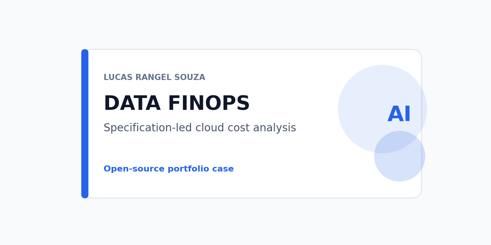
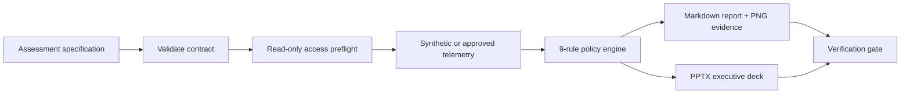

# Cloud data FinOps SDD toolkit



A specification-driven, fixture-first reference for assessing data-platform cost signals across GCP and AWS. A versioned assessment specification drives access preflight, policy evaluation, a technical report, and an executive deck. It proves the complete SDD loop on synthetic telemetry; it does not analyze a real cloud account.

## Architecture



*Alt text: a versioned specification is validated, checked against a read-only access boundary, evaluated by nine cost/performance rules against synthetic or approved telemetry, and turned into a Markdown report with PNG evidence and a PPTX deck, both checked by a deterministic verification gate.*

## Capabilities and non-goals

Implemented and tested (126 unit tests):

- `validate`, `preflight`, `access-plan`, `report`, `deck`, and `synth` CLI commands ([cli.py](cloud_data_finops/cli.py));
- a preflight guard that rejects GCP Owner/Editor, AWS AdministratorAccess, unapproved billing datasets, unrestricted Athena, and unscoped S3 paths before any collection runs ([preflight.py](cloud_data_finops/preflight.py), [safety.py](cloud_data_finops/safety.py));
- nine rules across BigQuery, AWS cost/tag anomalies, idle resources, and commitment coverage, each separating observed evidence, calculation, recommendation, estimated impact, and confidence — see the [rule catalog](docs/rule-catalog.md) ([policies/](cloud_data_finops/policies/));
- a seeded synthetic multi-cloud telemetry generator ([synthetic.py](cloud_data_finops/synthetic.py));
- a deterministic Markdown report, PNG evidence cards with separate units, and a byte-reproducible seven-slide PPTX deck built with `python-pptx` (no external renderer) ([report.py](cloud_data_finops/report.py), [presentations/deck.py](cloud_data_finops/presentations/deck.py));
- a release/checksum gate that rebuilds every artifact and compares it against a versioned manifest ([release.py](cloud_data_finops/release.py), [reproduce.py](scripts/reproduce.py)).

Not provided: a live GCP/AWS collector (adapters accept only injected metadata in this release), any monetary savings claim without a complete pricing/forecast input, and business-table access of any kind.

## Quick start

Python 3.12 (the package declares `>=3.10`; checksums below were recorded with 3.12).

```powershell
python -m pip install -r requirements-dev.txt
python -m pip install --no-deps -e .
make check          # or: python scripts/check.py
make reproduce       # or: python scripts/reproduce.py
```

`make reproduce` rebuilds the access plan, findings, report, deck, and PNG from the checked-in fixture and compares each SHA-256 against [`docs/evidence/release-fixture/SHA256SUMS`](docs/evidence/release-fixture/SHA256SUMS); see [docs/reproduce.md](docs/reproduce.md) for the full expected output and a troubleshooting table.

## Repository structure

```text
cloud_data_finops/   contracts, access plan, preflight, safety guards, policies/, adapters/, presentations/, release
skills/               reusable agent skills for analysis, report writing, and deck production
tests/                unit, golden/regression, and safety tests; tests/fixtures/ and tests/golden/
docs/                 architecture, rule catalog, access plan, reproduce guide, dated evidence
articles/             article draft
```

## Data source, licensing, and privacy

All current outputs come from `tests/fixtures/assessment.json`, generated by the seeded synthetic generator. No customer data, credential, or live billing export enters this repository. Apache-2.0 covers the code.

## Evaluation and rule catalog

The fixture specification produces 11 findings from 9 rules (see the [rule catalog](docs/rule-catalog.md) for thresholds and the finding model). Findings are examples that prove the mechanism; they are not a claim about a customer environment, an observed bill, or a guaranteed saving.

## Testing and CI

`make check` runs formatting, lint (`ruff`), compilation, a secret scan, a documentation link check, 126 unit tests, and the four core CLI commands. CI runs the same gate on every push and pull request.

## Deployment

None by default. An optional live-integration path (GCP/AWS adapters against a real, user-authorized account) is out of scope for this release and never runs in CI; see [docs/rule-catalog.md](docs/rule-catalog.md) for what a live adapter would still need.

## Trade-offs, limitations, and cost considerations

Several rules (BQ-001, BQ-003, AWS-001, AWS-002) deliberately report no monetary estimate because the fixture carries no pricing model; CMT-001 requires complete evidence (12 months of history, an approved discount rate, a confirmed forecast) before it estimates anything. The PNG evidence checksum is informational only, because font rasterization can differ across operating systems.

## Security notes and responsible-use boundary

Preflight and safety guards are tested against positive, negative, and boundary cases (`tests/test_access.py`, `tests/test_safety.py`). A rejection message never echoes the rejected request, because a query or path can itself carry sensitive names. See [SECURITY.md](SECURITY.md).

## Replication guide and evidence

[docs/reproduce.md](docs/reproduce.md) has the full command sequence, expected SHA-256 values, and troubleshooting. [docs/ACCESS_PLAN.md](docs/ACCESS_PLAN.md) documents the full access boundary.

## Published articles and case studies

[From access boundary to FinOps findings](articles/from-access-boundary-to-finops-findings.md) is a draft for later manual publication; not yet published elsewhere.

## Roadmap

- A mocked-then-live GCP/AWS adapter path, gated behind an explicit, separately authorized access plan.
- Extend the rule catalog's live-telemetry derivations (`partition_pruned`, `source_updates_per_day`) once a live adapter exists to test them against.

## License

Apache-2.0. See [LICENSE](LICENSE).
