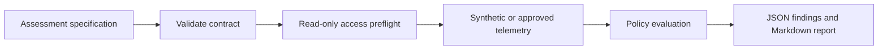

# Cloud data FinOps SDD toolkit

A fixture-first reference implementation for assessing data-platform cost signals across GCP and AWS. A versioned assessment specification drives validation, access preflight, policy evaluation, and report generation.

The repository is intentionally read-only. It analyzes metadata and approved cost telemetry. It does not access business-table content, create cloud resources, modify commitments, or include provider credentials.

## What works today

The initial vertical slice runs locally with synthetic telemetry:

- validates the assessment contract;
- blocks broad GCP and AWS permissions before collection;
- generates a provider-specific, read-only access request from the approved scope;
- detects an oversized unpartitioned BigQuery job and an AWS cost increase against a declared baseline;
- writes deterministic JSON findings, a Markdown report, and PNG evidence cards with separate units.

## Quick start

Python 3.10 or newer is required. On Windows, run the following commands from PowerShell:

```powershell
python -m unittest discover -s tests -v
python -m cloud_data_finops.cli access-plan --spec tests/fixtures/assessment.json --output artifacts/access-plan.json
python -m cloud_data_finops.cli report --spec tests/fixtures/assessment.json --output artifacts/demo
```

The generated plan is available at `artifacts/access-plan.json`; the report is available at `artifacts/demo/report.md`. If GNU Make is available, `make check` also runs compilation, unit tests, validation, preflight, access-plan generation, and report generation.

## Assessment flow



## Access boundaries

The GCP baseline for BigQuery job metadata uses `roles/bigquery.user` and `roles/bigquery.resourceViewer`. The AWS baseline uses narrowly scoped Cost Explorer reads such as `ce:GetCostAndUsage` and `ce:GetDimensionValues`. The full request boundary, prohibited permissions, and optional billing/CUR paths are documented in [docs/ACCESS_PLAN.md](docs/ACCESS_PLAN.md).

## Evidence status

All current outputs are based on `tests/fixtures/assessment.json`. The findings are examples, not a claim about a customer environment, an observed cloud bill, or a guaranteed saving.

## Roadmap

The next slices add access-plan generation, mocked provider adapters, visual report assets, PPTX generation, and CI. Live cloud collection will remain opt-in and will require an explicit approved scope.

## License

Apache-2.0. See [LICENSE](LICENSE).
