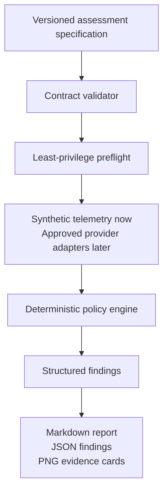

# Architecture

The public runtime has one trust boundary: the assessment specification. Validation and preflight run before policy evaluation, so a report cannot be generated from a specification that requests broad access.

The policy engine records evidence and assumptions separately. A cost signal can justify an investigation, but the current implementation does not turn it into a savings claim.

