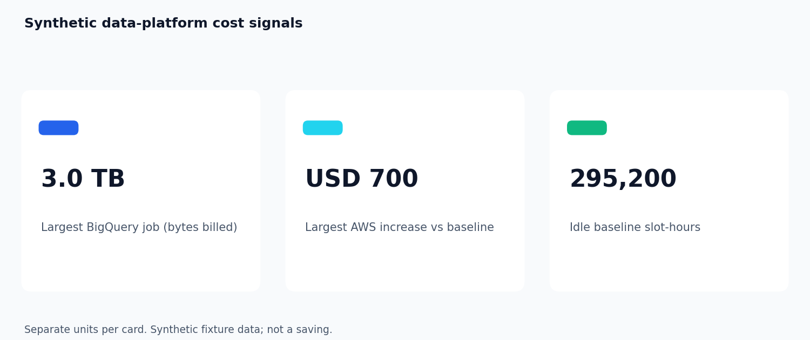

# Cloud data FinOps assessment

> **Synthetic data.** Generated from `synthetic` fixture telemetry. No value in this report describes a real environment, bill, or saving.

## Summary

- Assessment: `demo-2026-09`
- Period: 2026-08-02 to 2026-08-31
- Rules evaluated: 9
- Findings: 11 (high 5, medium 4, low 2)
- By provider: GCP 6, AWS 5

## Scope and access boundary

- GCP project roles: roles/bigquery.resourceViewer, roles/bigquery.user
- AWS actions: ce:GetCostAndUsage, ce:GetDimensionValues, ce:GetReservationCoverage, ce:GetSavingsPlansCoverage, cloudwatch:GetMetricData
- Business-table content access: none. Write access: none. Commitment purchases: none.

## Findings overview

| Priority | Rule | Subject | Finding | Confidence |
| --- | --- | --- | --- | --- |
| high | AWS-001 | `Amazon Athena / us-east-1` | Service cost in a region exceeds its baseline | medium |
| high | AWS-001 | `AWS Glue / us-east-1` | Service cost in a region exceeds its baseline | medium |
| high | BQ-001 | `job-expensive` | Job billed an excessive number of bytes | high |
| high | BQ-003 | `job-expensive` | Partitioned table read without partition pruning | high |
| high | BQ-003 | `job-events-scan` | Partitioned table read without partition pruning | high |
| medium | AWS-002 | `team=(untagged)` | Tagged cost allocation exceeds its baseline | medium |
| medium | BQ-002 | `fp-adhoc-cohort` | Expensive query pattern runs repeatedly | medium |
| medium | BQ-004 | `fp-hourly-kpi-refresh` | Scheduled query runs more often than its source changes | medium |
| medium | BQ-005 | `res-batch-etl` | Reservation baseline slots are mostly idle | medium |
| low | AWS-003 | `redshift-reporting` | Data-platform resource is underutilized | low |
| low | CMT-001 | `AWS Glue` | Steady on-demand usage with low commitment coverage | medium |

## Findings

### AWS-001 · Amazon Athena / us-east-1: Service cost in a region exceeds its baseline

Priority: high. Provider: `aws`. Evidence source: `aws.costs`.

#### Observed evidence

- `service`: `"Amazon Athena"`
- `region`: `"us-east-1"`
- `cost_usd`: `1400.0`
- `baseline_usd`: `700.0`

#### Calculation

- Formula: `increase_usd = cost_usd - baseline_usd; ratio = cost_usd / baseline_usd; fires when ratio >= min_ratio_to_baseline and increase_usd >= min_increase_usd`
- Input `cost_usd`: `1400.0`
- Input `baseline_usd`: `700.0`
- Input `min_ratio_to_baseline`: `1.5`
- Input `min_increase_usd`: `100.0`
- Result `increase_usd`: `700.0`
- Result `ratio_to_baseline`: `2.0`
- Unit of `cost_usd`: USD per assessment period
- Unit of `baseline_usd`: USD per assessment period
- Unit of `ratio_to_baseline`: ratio
- Assumption: Cost is grouped by service and region for the assessment period.
- Assumption: The baseline is the declared comparison period, not a forecast or a budget.

#### Recommendation

Inspect workload changes, tags, and query patterns for this service and region before changing reservations or commitments.

#### Estimated impact

Not estimated: the increase is observed evidence; the avoidable share is unknown until the workload is reviewed.

#### Confidence

medium

### AWS-001 · AWS Glue / us-east-1: Service cost in a region exceeds its baseline

Priority: high. Provider: `aws`. Evidence source: `aws.costs`.

#### Observed evidence

- `service`: `"AWS Glue"`
- `region`: `"us-east-1"`
- `cost_usd`: `480.0`
- `baseline_usd`: `300.0`

#### Calculation

- Formula: `increase_usd = cost_usd - baseline_usd; ratio = cost_usd / baseline_usd; fires when ratio >= min_ratio_to_baseline and increase_usd >= min_increase_usd`
- Input `cost_usd`: `480.0`
- Input `baseline_usd`: `300.0`
- Input `min_ratio_to_baseline`: `1.5`
- Input `min_increase_usd`: `100.0`
- Result `increase_usd`: `180.0`
- Result `ratio_to_baseline`: `1.6`
- Unit of `cost_usd`: USD per assessment period
- Unit of `baseline_usd`: USD per assessment period
- Unit of `ratio_to_baseline`: ratio
- Assumption: Cost is grouped by service and region for the assessment period.
- Assumption: The baseline is the declared comparison period, not a forecast or a budget.

#### Recommendation

Inspect workload changes, tags, and query patterns for this service and region before changing reservations or commitments.

#### Estimated impact

Not estimated: the increase is observed evidence; the avoidable share is unknown until the workload is reviewed.

#### Confidence

medium

### BQ-001 · job-expensive: Job billed an excessive number of bytes

Priority: high. Provider: `gcp`. Evidence source: `gcp.jobs`.

#### Observed evidence

- `job_id`: `"job-expensive"`
- `bytes_billed`: `3000000000000`
- `fingerprint`: `"fp-orders-full-scan"`

#### Calculation

- Formula: `terabytes_billed = bytes_billed / 10^12; fires when bytes_billed >= threshold_bytes`
- Input `bytes_billed`: `3000000000000`
- Input `threshold_bytes`: `1000000000000`
- Result `terabytes_billed`: `3.0`
- Unit of `bytes_billed`: bytes
- Unit of `terabytes_billed`: TB (10^12 bytes)
- Assumption: bytes_billed is the billed volume reported by job metadata; it is used as a volume signal, not a price.

#### Recommendation

Review the query plan, selected columns, and filters for this job before changing the workload.

#### Estimated impact

Not estimated: the assessment supplies no BigQuery pricing model, edition, or location.

#### Confidence

high

Related findings on the same subject: BQ-003.

### BQ-003 · job-expensive: Partitioned table read without partition pruning

Priority: high. Provider: `gcp`. Evidence source: `gcp.jobs`.

#### Observed evidence

- `job_id`: `"job-expensive"`
- `references_partitioned_table`: `true`
- `partition_pruned`: `false`
- `bytes_billed`: `3000000000000`

#### Calculation

- Formula: `fires when references_partitioned_table and not partition_pruned and bytes_billed >= min_bytes_billed`
- Input `bytes_billed`: `3000000000000`
- Input `min_bytes_billed`: `100000000000`
- Result `terabytes_billed`: `3.0`
- Unit of `bytes_billed`: bytes
- Unit of `terabytes_billed`: TB (10^12 bytes)
- Assumption: The reduction from pruning depends on filter selectivity, which job metadata does not reveal.

#### Recommendation

Add or correct a filter on the partitioning column and confirm pruning in the query plan.

#### Estimated impact

Not estimated: the share of partitions a filter would skip is unknown.

#### Confidence

high

Related findings on the same subject: BQ-001.

### BQ-003 · job-events-scan: Partitioned table read without partition pruning

Priority: high. Provider: `gcp`. Evidence source: `gcp.jobs`.

#### Observed evidence

- `job_id`: `"job-events-scan"`
- `references_partitioned_table`: `true`
- `partition_pruned`: `false`
- `bytes_billed`: `250000000000`

#### Calculation

- Formula: `fires when references_partitioned_table and not partition_pruned and bytes_billed >= min_bytes_billed`
- Input `bytes_billed`: `250000000000`
- Input `min_bytes_billed`: `100000000000`
- Result `terabytes_billed`: `0.25`
- Unit of `bytes_billed`: bytes
- Unit of `terabytes_billed`: TB (10^12 bytes)
- Assumption: The reduction from pruning depends on filter selectivity, which job metadata does not reveal.

#### Recommendation

Add or correct a filter on the partitioning column and confirm pruning in the query plan.

#### Estimated impact

Not estimated: the share of partitions a filter would skip is unknown.

#### Confidence

high

### AWS-002 · team=(untagged): Tagged cost allocation exceeds its baseline

Priority: medium. Provider: `aws`. Evidence source: `aws.tag_costs`.

#### Observed evidence

- `tag_key`: `"team"`
- `tag_value`: `"(untagged)"`
- `cost_usd`: `650.0`
- `baseline_usd`: `300.0`

#### Calculation

- Formula: `increase_usd = cost_usd - baseline_usd; ratio = cost_usd / baseline_usd; fires when ratio >= min_ratio_to_baseline and increase_usd >= min_increase_usd`
- Input `cost_usd`: `650.0`
- Input `baseline_usd`: `300.0`
- Input `min_ratio_to_baseline`: `1.5`
- Input `min_increase_usd`: `100.0`
- Result `increase_usd`: `350.0`
- Result `ratio_to_baseline`: `2.1667`
- Unit of `cost_usd`: USD per assessment period
- Unit of `baseline_usd`: USD per assessment period
- Unit of `ratio_to_baseline`: ratio
- Assumption: Cost is grouped by cost-allocation tag value for the assessment period.
- Assumption: The baseline is the declared comparison period, not a forecast or a budget.

#### Recommendation

Assign an owner to untagged spend and enforce the tag before analysing the increase.

#### Estimated impact

Not estimated: the increase is observed evidence; the avoidable share is unknown until the workload is reviewed.

#### Confidence

medium

### BQ-002 · fp-adhoc-cohort: Expensive query pattern runs repeatedly

Priority: medium. Provider: `gcp`. Evidence source: `gcp.jobs`.

#### Observed evidence

- `fingerprint`: `"fp-adhoc-cohort"`
- `run_count`: `3`
- `total_bytes_billed`: `1200000000000`

#### Calculation

- Formula: `repeated_terabytes = (run_count - 1) * (total_bytes_billed / run_count) / 10^12`
- Input `run_count`: `3`
- Input `total_bytes_billed`: `1200000000000`
- Input `min_runs`: `3`
- Input `threshold_total_bytes`: `1000000000000`
- Result `average_terabytes_per_run`: `0.4`
- Result `repeated_terabytes`: `0.8`
- Unit of `total_bytes_billed`: bytes
- Unit of `repeated_terabytes`: TB (10^12 bytes)
- Assumption: The fingerprint groups jobs with the same normalized query; query text is not collected.
- Assumption: The estimate is an upper bound that holds only if one run's result could serve the other runs.

#### Recommendation

Check whether results can be materialized, cached, or shared across runs before changing the schedule.

#### Estimated impact

0.8 TB (10^12 bytes) in the assessment period (upper bound). Basis: Volume billed by every run after the first; it is not a monetary saving.

#### Confidence

medium

### BQ-004 · fp-hourly-kpi-refresh: Scheduled query runs more often than its source changes

Priority: medium. Provider: `gcp`. Evidence source: `gcp.schedules`.

#### Observed evidence

- `fingerprint`: `"fp-hourly-kpi-refresh"`
- `runs_per_day`: `6`
- `source_updates_per_day`: `1`
- `avg_bytes_billed`: `50000000000`

#### Calculation

- Formula: `excess_terabytes_30d = (runs_per_day - source_updates_per_day) * avg_bytes_billed * 30 / 10^12`
- Input `runs_per_day`: `6`
- Input `source_updates_per_day`: `1`
- Input `avg_bytes_billed`: `50000000000`
- Input `days`: `30`
- Result `excess_runs_per_day`: `5`
- Result `excess_terabytes_30d`: `7.5`
- Unit of `runs_per_day`: runs/day
- Unit of `avg_bytes_billed`: bytes
- Unit of `excess_terabytes_30d`: TB (10^12 bytes)
- Assumption: Runs and source updates are counted from job metadata over the assessment window.
- Assumption: A run that starts before the source changes again returns the same result as the previous run.

#### Recommendation

Align the schedule with source refreshes or trigger it on source updates, after confirming freshness requirements.

#### Estimated impact

7.5 TB (10^12 bytes) per 30 days (upper bound). Basis: Volume billed by runs that start between source updates; it is not a monetary saving.

#### Confidence

medium

### BQ-005 · res-batch-etl: Reservation baseline slots are mostly idle

Priority: medium. Provider: `gcp`. Evidence source: `gcp.reservations`.

#### Observed evidence

- `reservation_id`: `"res-batch-etl"`
- `baseline_slots`: `500`
- `avg_slots_used`: `90.0`
- `peak_slots_used`: `420.0`
- `hours_observed`: `720`

#### Calculation

- Formula: `utilization = avg_slots_used / baseline_slots; idle_slot_hours = (baseline_slots - avg_slots_used) * hours_observed`
- Input `baseline_slots`: `500`
- Input `avg_slots_used`: `90.0`
- Input `hours_observed`: `720`
- Input `max_avg_utilization`: `0.3`
- Result `utilization`: `0.18`
- Result `idle_slot_hours`: `295200.0`
- Unit of `baseline_slots`: slots
- Unit of `utilization`: ratio
- Unit of `idle_slot_hours`: slot-hours
- Assumption: Average slot usage comes from reservation timeline metadata for the observed hours.
- Assumption: Peak usage is shown because a lower baseline can delay queries during peaks.

#### Recommendation

Review baseline and autoscaling settings with the workload owner against peak usage; this is an observation, not a capacity change.

#### Estimated impact

295,200.0 slot-hours of idle baseline capacity in the observed window. Basis: Observed capacity minus observed average use; no price is applied.

#### Confidence

medium

### AWS-003 · redshift-reporting: Data-platform resource is underutilized

Priority: low. Provider: `aws`. Evidence source: `aws.resources`.

#### Observed evidence

- `resource_id`: `"redshift-reporting"`
- `type`: `"redshift-cluster"`
- `utilization`: `0.04`
- `observed_days`: `30`
- `monthly_cost_usd`: `2200.0`

#### Calculation

- Formula: `idle_cost_usd = monthly_cost_usd * (1 - utilization)`
- Input `utilization`: `0.04`
- Input `observed_days`: `30`
- Input `monthly_cost_usd`: `2200.0`
- Input `max_utilization`: `0.1`
- Input `min_observed_days`: `14`
- Result `idle_cost_usd`: `2112.0`
- Unit of `utilization`: ratio
- Unit of `monthly_cost_usd`: USD per month
- Unit of `idle_cost_usd`: USD per month
- Assumption: Utilization comes from approved metric telemetry averaged over observed_days.
- Assumption: Cost is assumed to scale linearly with provisioned capacity; minimum sizes and dependencies can make the real reduction smaller.

#### Recommendation

Confirm dependencies and service-level requirements with the owner before resizing, pausing, or retiring the resource.

#### Estimated impact

2,112.0 USD per month (upper bound). Basis: Cost share attributed to unused capacity under the linear-cost assumption; it is not a confirmed saving.

#### Confidence

low

### CMT-001 · AWS Glue: Steady on-demand usage with low commitment coverage

Priority: low. Provider: `aws`. Evidence source: `aws.commitments`.

#### Observed evidence

- `service`: `"AWS Glue"`
- `monthly_on_demand_usd`: `[410.0, 395.0, 420.0, 405.0, 415.0, 400.0]`
- `coverage_ratio`: `0.0`

#### Calculation

- Formula: `coefficient_of_variation = population_stdev(monthly_on_demand_usd) / mean(monthly_on_demand_usd)`
- Input `months`: `6`
- Input `coverage_ratio`: `0.0`
- Input `max_coverage_ratio`: `0.5`
- Input `max_coefficient_of_variation`: `0.15`
- Result `coefficient_of_variation`: `0.021`
- Result `mean_monthly_usd`: `407.5`
- Result `lowest_monthly_usd`: `395.0`
- Result `missing_evidence`: `["12 months of usage history", "an approved discount rate", "a usage forecast confirmed by the workload owner"]`
- Unit of `monthly_on_demand_usd`: USD per month
- Unit of `coverage_ratio`: ratio
- Unit of `coefficient_of_variation`: ratio
- Assumption: Past monthly usage does not guarantee future usage.
- Assumption: A purchase is only considered when history, discount rate, and forecast confirmation are all supplied.

#### Recommendation

No purchase recommendation: evidence is incomplete (missing 12 months of usage history, an approved discount rate, a usage forecast confirmed by the workload owner).

#### Estimated impact

Not estimated: 12 months of usage history, an approved discount rate, a usage forecast confirmed by the workload owner not supplied.

#### Confidence

medium

## Limitations

- All telemetry is synthetic and generated from a fixed seed; no finding describes a real organization, project, account, or bill.
- No pricing model is applied. Byte volumes, slot-hours, and USD differences are evidence or upper-bound estimates, not savings.
- Thresholds are catalog defaults documented in docs/rule-catalog.md; a real assessment must review them against its own workload.
- Commitment observations never become purchase recommendations unless history, an approved discount rate, and a confirmed forecast are all supplied.
- Collectors use injected fixture clients. Live query templates pass the safety guards in tests but have not been run against a provider.

## Sources

- [BigQuery INFORMATION_SCHEMA.JOBS required roles](https://cloud.google.com/bigquery/docs/information-schema-jobs)
- [Google Cloud Billing access control](https://cloud.google.com/billing/docs/access-control)
- [AWS Cost Explorer authorization reference](https://docs.aws.amazon.com/service-authorization/latest/reference/list_ce.html)
- [Athena IAM guidance](https://docs.aws.amazon.com/athena/latest/ug/security-iam-athena.html)
